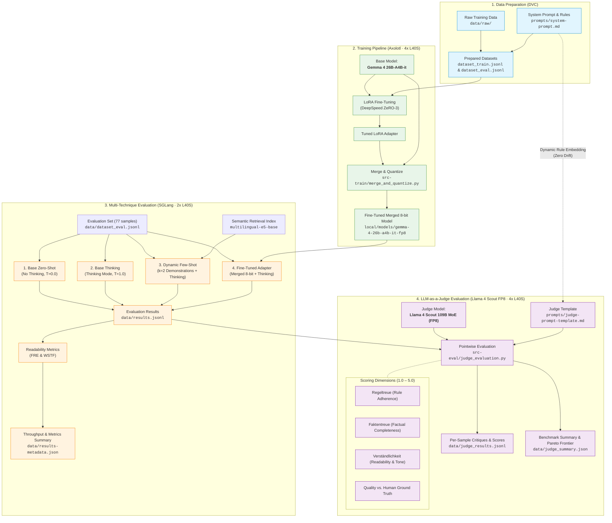

# BegleitApp Training (Gemma 4 on HSUper)

This repository contains code to fine-tune and evaluate adapters for
[Google Gemma 4 26B-A4B](https://huggingface.co/google/gemma-4-26B-A4B-it)
on the [HSUper](https://www.hsu-hh.de/hpc/en/hsuper/) GPU infrastructure.  
[Axolotl](https://axolotl.ai) is used to train the adapter for the Mixture of
Experts model, and [SGLang](https://sglang.ai) is used to provide high-performance
inference on the quantized base model merged with the tuned adapter.

Training and evaluation is designed for **NVIDIA L40S GPUs** as provided by HSUper.

The actual training data is stored using [DVC](https://dvc.org).

## Pipeline Architecture

---

## Details

See [docs/implementation-details.md](docs/implementation-details.md) for details on training and inference.  
See [docs/judge-evaluation.md](docs/judge-evaluation.md) for details on LLM-as-a-Judge evaluation.  
See [adrs](adrs/) for Architecture Decision Records.